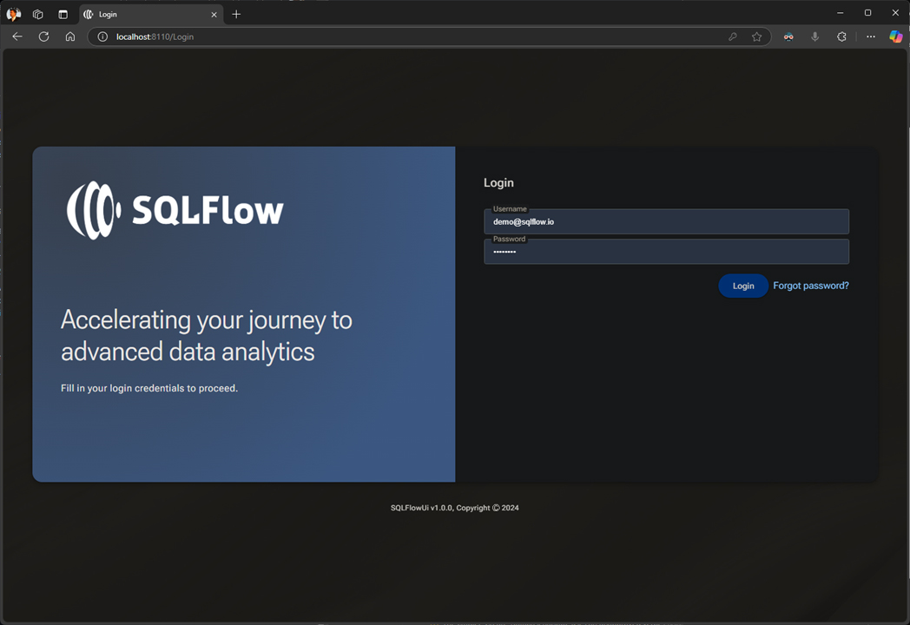
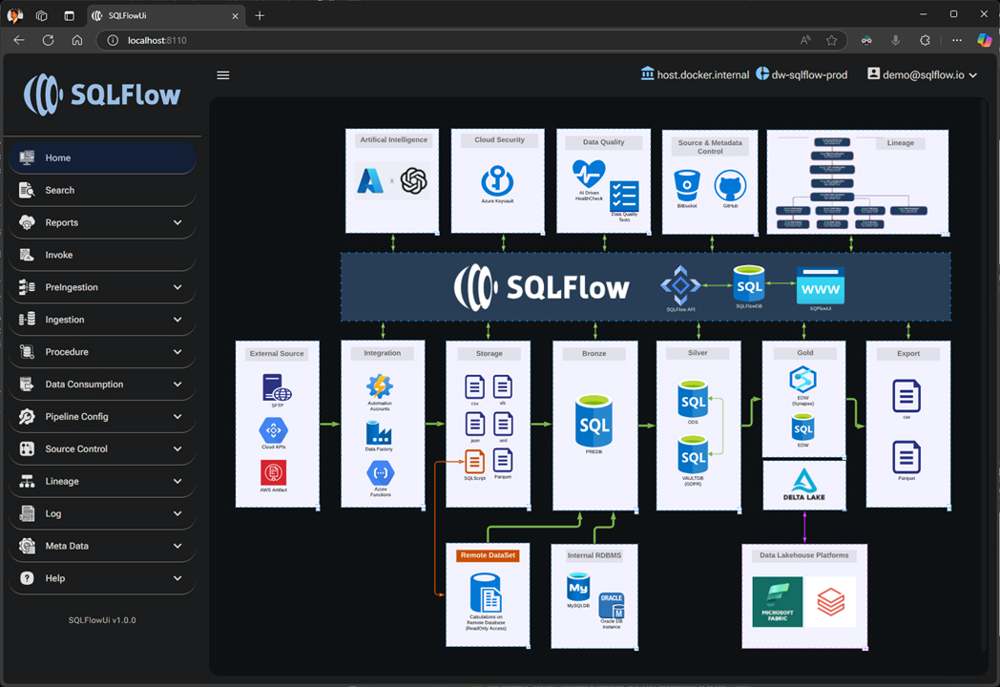
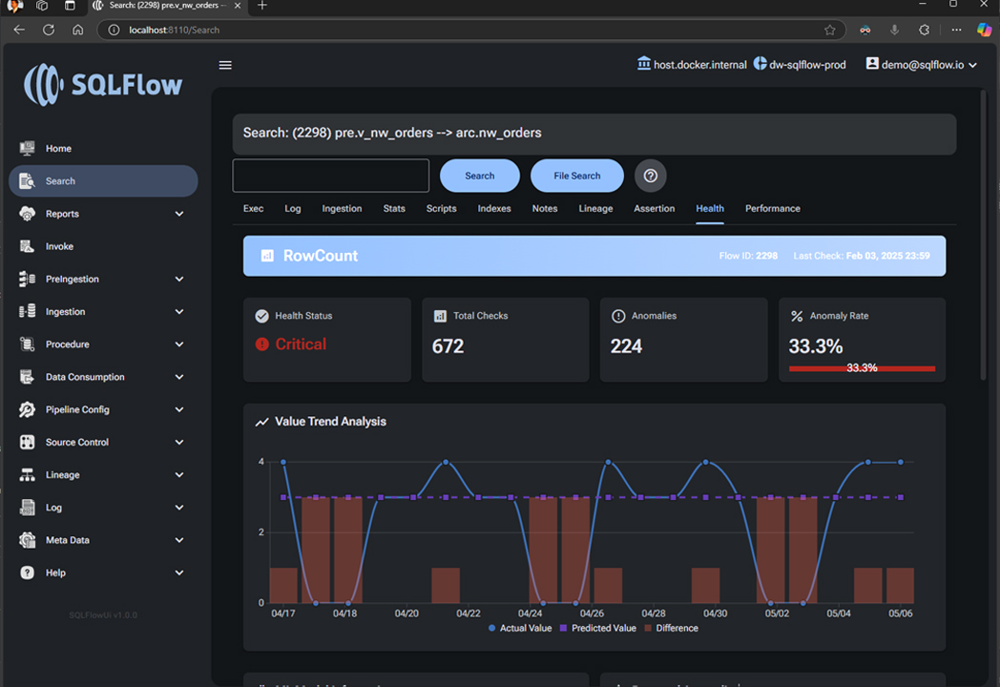
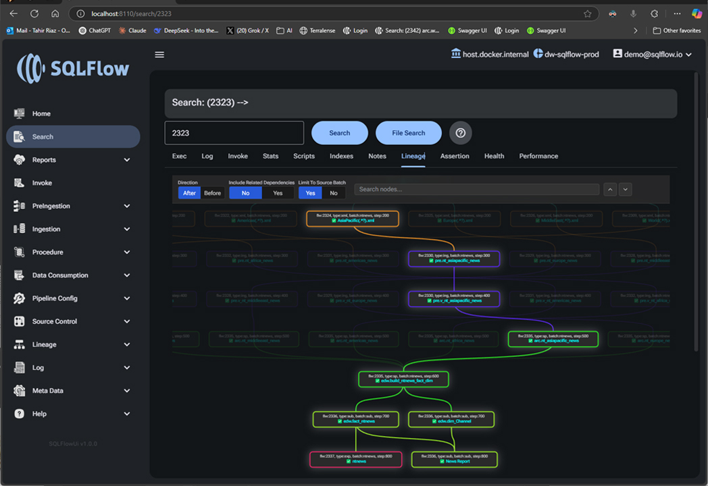
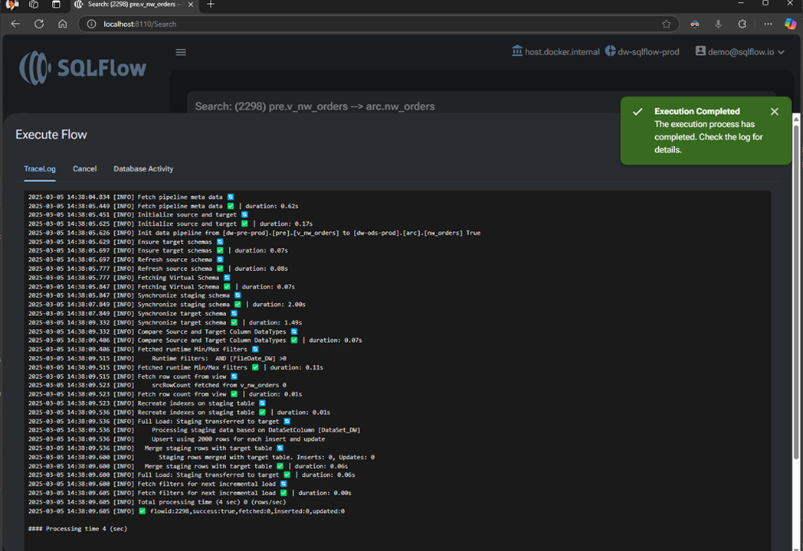
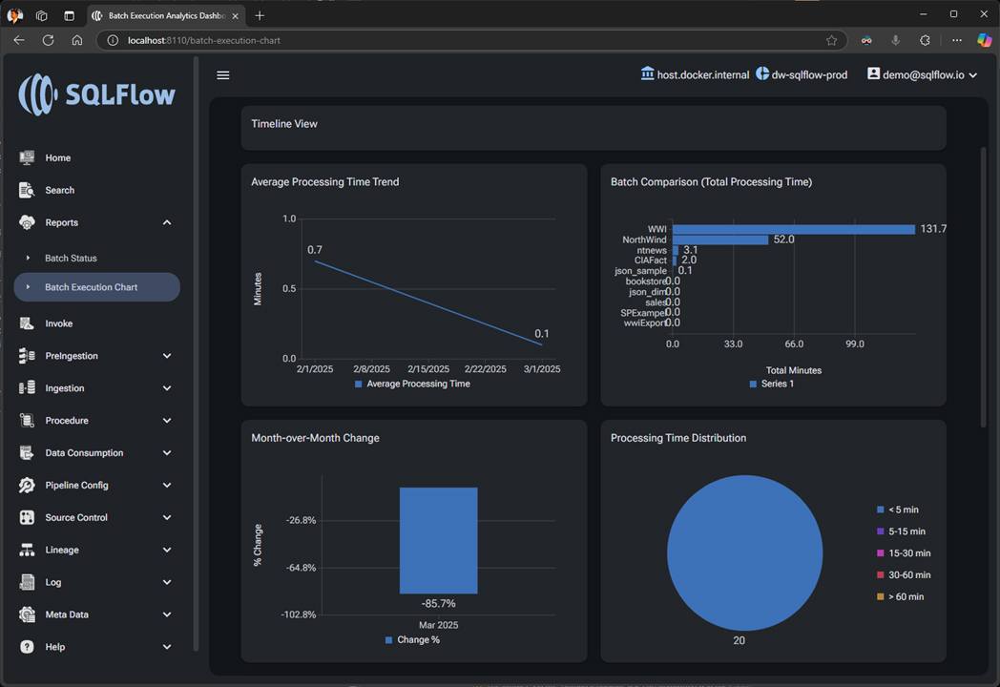

# 🔄 **SQLFlow: The Future of Hassle-Free Data Pipelines**  

**SQLFlow** is an **open-source, metadata-driven automation framework** designed to eliminate the complexities of modern **data warehouse management, pipeline automation, and data governance**. Unlike traditional ETL frameworks, **SQLFlow features built-in schema evolution**, meaning it **automatically adapts to changing data structures**—ensuring a **hassle-free, zero-maintenance data delivery experience**.  

With SQLFlow, data engineers and architects can **build scalable, resilient, and future-proof data pipelines** without the constant overhead of manual schema updates or pipeline disruptions. SQLFlow is fully containerized and available on [Docker Hub](https://hub.docker.com/repository/docker/businessiq/sqlflow/general), making deployment seamless across environments.

## ✨ **What Sets SQLFlow Apart?**  
🔹 **Automatic Schema Evolution** – Unlike other frameworks, SQLFlow dynamically adjusts to incoming schema changes, eliminating the need for manual intervention.  
🔹 **Zero Maintenance Pipelines** – Say goodbye to pipeline failures caused by evolving data structures.  
🔹 **Metadata-Driven Simplicity** – Automate everything—from data ingestion to governance—without writing custom scripts for every change.  
🔹 **Scalability at Its Core** – SQLFlow grows with your data, ensuring seamless performance at any scale.  

## 🏢 **Trusted by Leading Enterprises**  
SQLFlow is actively used by organizations optimizing large-scale data operations:  

- **Kolumbus AS** – Norway’s public transportation leader, managing data for buses, boats, and trams. 
- **Nortura SA** – Norway’s largest food supplier (23.545B NOK revenue), where SQLFlow supported critical data operations.  

## 👥 **Support and Community**  
Whether you have questions, issues, or success stories, feel free to reach out. Together, let's redefine data warehousing.  
This Slack workspace allows developers, data engineers, and contributors to discuss SQLFlow, ask questions, and share insights.

### Click the link to join the workspace: [**Join SQLFlow Community Slack**](https://join.slack.com/t/sqlflow/shared_invite/zt-31tob1pxv-t4uVIjgucYRakm~W5Oik8A)

- **Email:** [tahir@sqlflow.io](mailto:tahir@sqlflow.io)  
- **LinkedIn:** [Contact](https://www.linkedin.com/in/businessiq/)  

## SQLFlow presentation in Norwegian at anual BouvetOne Developer Conference

## 📚 **SQLFlow UI**  

  
  
  
  
  
  

## 🔑 **Core Features**  

### 🚀 **Metadata-Driven Automation**  
Eliminate manual tasks by leveraging metadata to automate the end-to-end data warehouse processes, significantly increasing operational efficiency.  

### 🔄 **Dynamic Data Pipelines**  
Automatically generate and manage data pipelines from defined metadata, ensuring seamless and error-free data flow from source systems to data targets.  

### 📊 **Effortless Schema Management**  
Automate schema creation, updates, and versioning dynamically, allowing teams to focus on data strategy rather than operational details.  

### 🛠 **Robust Data Transformations**  
Utilize built-in transformation capabilities defined via metadata to perform complex, consistent, and maintainable data cleansing, enrichment, and standardization.  

### 🔍 **Data Lineage and Impact Analysis**  
Gain comprehensive visibility into data flow, origin, and transformations with automated lineage tracking. This capability significantly improves data governance, regulatory compliance, and enables proactive impact analysis.  

### 📈 **Container-Based Vertical Scaling**  
Leverage Azure Container Instances and Ingress for responsive vertical scaling of SQLFlow APIs, optimizing performance and resource allocation during peak demand.  

### ✅ **Data Quality Assurance**  
Integrate machine learning techniques for proactive monitoring of data quality, anomaly detection, and historical trend analysis, ensuring high data integrity and reliability.  

### 🔑 **MatchKey for Enhanced Data Integrity**  
Precisely monitor changes, including deletions, in source systems through the powerful MatchKey feature, offering customizable grace periods and flexible data lifecycle management aligned with business rules and governance policies.  

### 🛠 **Source Control Integration**  
Facilitate data pipeline development and collaboration by integrating seamlessly with popular source control systems, streamlining pipeline versioning and change tracking.  

### ⚡ **Scalable Performance**  
Ensure fast, reliable performance through pipelines built upon industry best practices, complemented by comprehensive logging for efficient debugging and tuning.  

### 📖 **Comprehensive Documentation**  
Easily onboard and maximize SQLFlow with detailed documentation covering everything from basic setup to advanced features.  

## 📚 **SQLFlow Installation and Configuration Guide**  
This [guide](https://github.com/TahirRiaz/SQLFlow/blob/master/Sandbox/README.md) will walk you through setting up SQLFlow using Docker containers. Setup is a breeze with our fully containerized solution that is publicly available on [Docker Hub](https://hub.docker.com/repository/docker/businessiq/sqlflow/general).  

## 🏗️ **Architecture**  

  

## 🤝 **Contributing**  
Your contributions help us grow. You can:  
- Blog about it  
- Comment on issues  
- Fork the repository  
- Star the project  
- Share with peers  
- Report bugs and feature requests  

## ⚖️ **Licensing**  
SQLFlow is licensed under the **GNU General Public License v3.0**. For detailed terms, refer to the [LICENSE](LICENSE) file or visit [gnu.org/licenses/gpl-3.0](https://gnu.org/licenses/gpl-3.0).  

An alternative version under the permissive **MIT License** is available upon request. This license allows reuse in proprietary applications. Please contact us for more details.  

---
